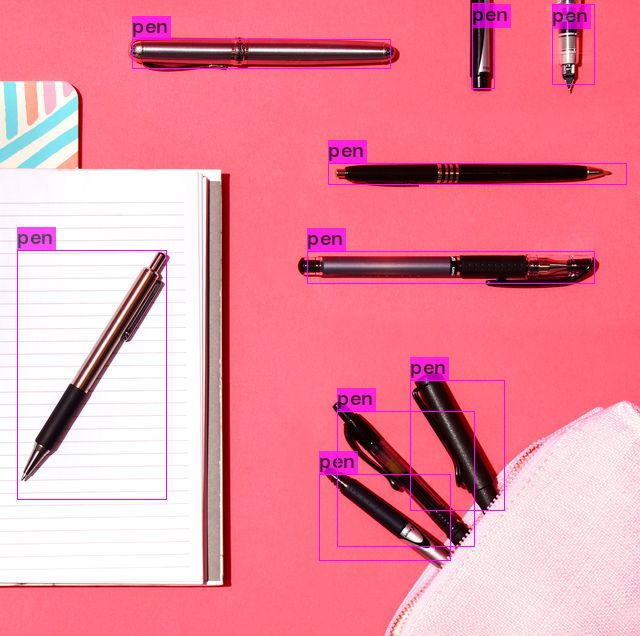

# Object Detection using YOLOv4

En esta implementación del modelo YOLO en su versión 4, se entrenaron sus pesos
para detectar objetos fuera de el Dataset COCO, bajo el cual se entrenó originalmente YOLO, para la detección de 80 diferentes clases.

Tomando como referencia el tutorial del canal de YouTube [The AI Guy](https://www.youtube.com/playlist?list=PLKHYJbyeQ1a3tMm-Wm6YLRzfW1UmwdUIN), se modificó esta implementación original para detectar una clase personalizada de un objeto disponible dentro de [Open Images Dataset v6](https://storage.googleapis.com/openimages/web/index.html), del cual se tomaron la información etiquetada.

## Clase Personalizada

La clase seleccionada para detección fue **Pen**, pues fue un objeto disponible para todos los miembros del equipo, lo cual facilitó las pruebas hechas al modelo final en la etapa de predicciones.

## Recolección de Datos

Para recolectar la información de la página y recuperar las imágenes de interés, tanto para el entrenamiento como para la validación, se utilizó el [Toolkit OIDv4](https://github.com/theAIGuysCode/OIDv4_ToolKit), el cual nos permitió descargar dichas imágenes y convertir las etiquetas al formato propio de YOLOv4.

## Darknet Framework

Para tener acceso a la implementación de YOLOv4, se accedió al repositorio oficial de [AlexeyAB](https://github.com/AlexeyAB/darknet), en donde tiene disponible un framework mediante el cual es posible acceder a dicho modelo y las herramientas que facilitan la configuración y entrenamiento del mismo.

## Entrenamiento

Por medio de la herramienta Google Colab, se desarrolló el entrenamiento del modelo. El código se puede acceder por medio de la siguiente imagen:

Para esto, una vez teniendo a nuestra disposición el framework de Darknet, se modificaron los archivos de configuración, para lograr que el modelo únicamente detecte nuestra clase personalizada.

Para los pesos de nuestro modelo, se utilió una configuración preentrenada, sobre la cual trabajamos para obtener un mejor rendimiento del modelo final.

Dentro del entrenamiento se seleccionaron 6000 iteraciones, de las cuales la tendencia general se muestra en la imagen:

Como es posible apreciar, tras un entrenamiento de 2600 iteraciones, se concluyó que la precisión del modelo podría perderse de continuar entrenando, pues caería en *overfitting*.

El puntaje mAP de la mejor configuración alcanzada es de 86%, suficiente para los propósitos de la actividad.

El archivo con los pesos entrenados para el modelo se puede acceder a través del siguiente [link a Google Drive](https://drive.google.com/file/d/1-08ODXzev-rHYPAcOvld8H2iwIMka4dH/view?usp=sharing). Es necesario acceder con una cuenta institucional.

## Predicciones

Finalmente, el modelo se probó tanto con imágenes como con vídeo, alcanzando predicciones satisfactorias.

### Predicción en imágenes

El resultado de la prueba realizada por medio de imágenes se muestra a continuación:

Dentro del archivo de Google Colab es posible seguir el proceso de prueba mostrado en esta sección.

### Predicción en video

El resultado de la prueba realizada se puede acceder a través de la siguiente liga a [Google Drive](https://drive.google.com/file/d/1-BGxeloP_nnuSyfX5MegLyEYdULahVjO/view?usp=sharing).

### Autoevaluación y Coevaluación

En la siguiente tabla se presenta la calificación obtenida por cada miembro del equipo de acuerdo a su contribución a la actividad:

Alumno |Matrícula | Nota
-------|----- | ----------
Samuel Pacheco Cantú | A01039815 | 5
Helmer Enrique Muñoz | A00819255 | 5
Rodolfo Presa Silva | A00817281 | 5
Ricardo Urbina Prieto | A00820309 | 5
Mario Alberto Ortega | A01730557 | 5
